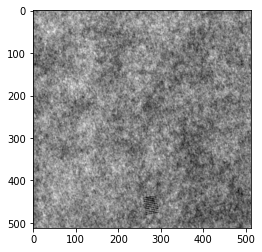
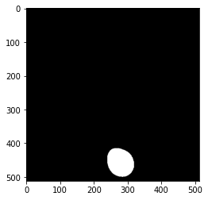

# Deep Neural Networks: Defect Segmentation on Textured Surfaces

This project is inspired from the paper [U-Net: Convolutional Networks for Biomedical Image Segmentation](https://arxiv.org/abs/1505.04597)

## Objective

To develop a model to detect defects by Industrial Optical Inspection on Textured Surfaces. This problem can be modeled as an Image Segmentation task where you can find the pixels where the defect occurs in a given image.

## Dataset

Dataset can be found [here](https://hci.iwr.uni-heidelberg.de/content/weakly-supervised-learning-industrial-optical-inspection). You can also download the dataset from [shared folder](https://drive.google.com/file/d/1w-P1hpF8FUo4nVBL5uAkgi7H0gTFQlq8/view).

The data is artificially generated, but similar to real world problems. The first six out of ten datasets, denoted as development datasets, are supposed to be used for algorithm development. The remaining four datasets, which are referred to as competition datasets, can be used to evaluate the performance. Researchers should consider not using or analyzing the competition datasets before the development is completed as a code of honour.

* Each development (competition) dataset consists of 1000 (2000) 'non-defective' and of 150 (300) 'defective' images saved in grayscale 8-bit PNG format.
* Each dataset is generated by a different texture model and defect model.
* 'Non-defective' images show the background texture without defects, 'defective' images have exactly one labelled defect on the background texture.
* All datasets has been randomly split into a training and testing sub-dataset of equal size.
* Weak labels are provided as ellipses roughly indicating the defective area. Technically, defective images are augmented with a separate grayscale 8-bit image in the PNG format located in a folder 'Label'. The values 0 and 255 denote background and defective area, respectively.

## Model U-net Like

We create a Unet like model. The Unet Model is well determined in the following figure.

## Running

To successfully run the application
1. Add the data set to your respective drive.
2. Download the repository and add the Notebook to your drive to open in Google Colaboratory.
3. Change the system settings to run on GPU.
4. Verify the path to dataset.
5. Once done, run all in the colab.
  - It should save the model in drive.
  - Detect the defect in a random sample.

## Conclusion

We observe that the defect that is difficult for human eyes to detect is accurately determined by the model. We measure the success of our model by the dice coefficients. A dice value of 0.7 determines a good predicting accuracy for the model.

Input with Defect | Defect Detected
----|----
 | 
